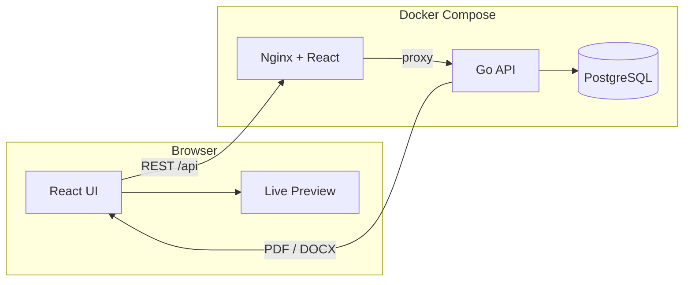

# Resume Builder

A full-stack resume builder for creating, customizing, and exporting professional resumes. Build in the browser with a live preview, manage sections dynamically, validate ATS compatibility, and download polished **PDF** or **DOCX** files.

Built with **React + TypeScript** on the frontend, **Go** on the backend, and **PostgreSQL** for persistence — all orchestrated with **Docker Compose**.

---

## Table of contents

- [Why use this?](#why-use-this)
- [Features](#features)
- [Architecture](#architecture)
- [Tech stack](#tech-stack)
- [Quick start](#quick-start)
- [Local development](#local-development)
- [Using the app](#using-the-app)
- [Templates & customization](#templates--customization)
- [ATS compatibility](#ats-compatibility)
- [API reference](#api-reference)
- [Project structure](#project-structure)
- [Configuration](#configuration)
- [Troubleshooting](#troubleshooting)

---

## Why use this?

Job applications increasingly pass through **Applicant Tracking Systems (ATS)** before a human ever sees your resume. This project helps you:

1. **Edit visually** — see changes instantly in a live preview pane
2. **Stay flexible** — add, remove, and reorder resume sections on the fly
3. **Stay safe for ATS** — use an ATS-optimized template, real-time score, and actionable checks
4. **Export anywhere** — download PDF for applications or DOCX for further editing in Word

---

## Features

### Editor & sections

| Capability | Details |
|---|---|
| **Live preview** | Right-hand preview updates as you type — no save-and-refresh cycle |
| **Section manager** | Enable, hide, reorder, and rename sections |
| **Add/remove blocks** | Summary, Work Experience, Education, Skills, Projects, Certifications, Languages, Custom |
| **Per-item editing** | Add multiple jobs, degrees, projects, etc. within each section |
| **Auto-save** | Changes debounce and persist to the API every 2 seconds |
| **Saved resumes** | Load and switch between previously saved resumes |

### Design & export

| Capability | Details |
|---|---|
| **4 templates** | ATS Optimized, Classic, Modern, Minimal |
| **25 fonts** | ATS-safe system fonts + Google Fonts (serif, sans-serif, modern) |
| **28 color presets** | Grouped palettes (neutrals, blues, greens, warm, purple, red) + custom hex |
| **Font size** | Adjustable from 9pt to 14pt with live preview |
| **PDF export** | Template-aware layout generated server-side |
| **DOCX export** | Word-compatible document built from embedded OOXML templates |

### ATS tooling

| Capability | Details |
|---|---|
| **ATS score ring** | Live percentage based on 8 compatibility checks |
| **Actionable tips** | Failed checks show specific guidance to fix issues |
| **ATS-safe mode** | Restricts fonts and colors to parser-friendly options |
| **Standard headings** | Warns when section titles deviate from ATS conventions |

---

## Architecture



**Request flow**

1. The React app calls `/api/*` (proxied to the Go backend in dev and production).
2. Resume JSON is stored in PostgreSQL (`resumes.data` JSONB column).
3. Export endpoints render PDF/DOCX from the resume payload using embedded Go templates.
4. SQL migrations and document templates are **embedded in the Go binary** via `go:embed` — no external files required at runtime.

---

## Tech stack

| Layer | Technology |
|---|---|
| Frontend | React 18, TypeScript, Vite |
| Backend | Go 1.22, chi router, pgx |
| Database | PostgreSQL 16 |
| PDF generation | gofpdf |
| DOCX generation | Embedded OOXML + archive/zip |
| Containers | Docker, Docker Compose, Nginx |

---

## Quick start

**Prerequisites:** Docker and Docker Compose

```bash
git clone <repo-url>
cd resume-builder
docker compose up --build
```

| Service | URL |
|---|---|
| **UI** | http://localhost:3000 |
| **API** | http://localhost:8080 |
| **Health check** | http://localhost:8080/health |

Stop services:

```bash
docker compose down
```

Reset the database (removes all saved resumes):

```bash
docker compose down -v
```

---

## Local development

Run each service independently for faster iteration.

### 1. Database

```bash
docker compose up db
```

Default credentials:

| Variable | Value |
|---|---|
| `DB_HOST` | `localhost` |
| `DB_PORT` | `5432` |
| `DB_USER` | `resume` |
| `DB_PASSWORD` | `resume` |
| `DB_NAME` | `resume_builder` |

### 2. Backend

```bash
cd backend
export DB_HOST=localhost DB_USER=resume DB_PASSWORD=resume DB_NAME=resume_builder
go run ./cmd/server
```

API listens on **:8080**. Migrations run automatically on startup from embedded SQL files.

### 3. Frontend

```bash
cd frontend
npm install
npm run dev
```

Dev server: **http://localhost:5173** — Vite proxies `/api` and `/health` to `http://localhost:8080`.

### Build for production

```bash
# Frontend
cd frontend && npm run build

# Backend
cd backend && go build -o server ./cmd/server
```

---

## Using the app

### Layout

The workspace has three panes:

```
┌──────────────┬─────────────────────┬──────────────┐
│   Sidebar    │       Editor        │   Preview    │
│  (tabs)      │  (active section)   │  (live)      │
└──────────────┴─────────────────────┴──────────────┘
```

**Sidebar tabs**

| Tab | Purpose |
|---|---|
| **Sections** | Manage section order, visibility, and headings |
| **Design** | Pick template, fonts, colors, and font size |
| **ATS** | View compatibility score and fix failing checks |
| **Saved** | Load previously saved resumes |

### Typical workflow

1. Fill in **Contact** information (name, email, phone).
2. Write a **Professional Summary** (2–4 sentences).
3. Add **Work Experience** entries — one bullet per line for achievements.
4. Add **Education**, **Skills**, and optional sections.
5. Open the **ATS** tab and aim for **80%+** before exporting.
6. Click **PDF** or **DOCX** in the header to download.

---

## Templates & customization

### Templates

| Template | Layout | ATS-friendly |
|---|---|---|
| **ATS Optimized** | Single column, standard fonts, plain headings | Yes |
| **Classic** | Single column with section dividers | Yes |
| **Modern** | Two-column with colored sidebar | No |
| **Minimal** | Centered typography | No |

### Fonts (25 options)

- **ATS Safe** — Arial, Helvetica, Calibri, Verdana, Tahoma, Times New Roman, Georgia, Garamond, Cambria
- **Sans Serif** — Lato, Open Sans, Roboto, Source Sans 3, Work Sans
- **Modern** — Inter, Montserrat, Poppins, Nunito, Raleway
- **Serif** — Merriweather, Playfair Display, Libre Baskerville, Crimson Text, Lora, EB Garamond

### Colors (28 presets + custom)

Grouped swatches: Neutrals, Blues & Teals, Greens, Warm tones, Purples, Reds — plus a hex input and native color picker.

When **ATS-safe mode** is enabled, only dark accent colors and ATS-friendly fonts are available.

---

## ATS compatibility

### What the score checks

| Check | What it validates |
|---|---|
| ATS-friendly layout | Template is single-column (ATS or Classic) |
| Contact information | Full name, email, and phone are present |
| Standard section headings | Titles match conventions like "Work Experience" |
| Consistent date format | Dates use `YYYY` or `YYYY-MM` |
| Skills as plain text | Skills are comma-separated text, not graphics |
| No empty sections | Enabled sections have content |
| Concise summary | Summary is 50–600 characters |
| Bullet-point experience | Descriptions use line breaks for bullets |

### Best practices

- Use the **ATS Optimized** template when applying online
- Keep headings standard: `Professional Summary`, `Work Experience`, `Education`, `Skills`
- Put contact info in plain text — no images or icons
- List skills as comma-separated text: `Go, TypeScript, React, PostgreSQL`
- Format dates as `2021-01` (not `Jan 2021` or `01/2021`)
- Write one achievement per line in experience descriptions
- Avoid tables, text boxes, headers/footers, and multi-column layouts for ATS submissions

---

## API reference

Base URL: `http://localhost:8080`

### Resumes

| Method | Path | Description |
|---|---|---|
| `GET` | `/api/resumes` | List all resumes (newest first) |
| `POST` | `/api/resumes` | Create a resume |
| `GET` | `/api/resumes/{id}` | Get a resume by ID |
| `PUT` | `/api/resumes/{id}` | Update a resume |
| `DELETE` | `/api/resumes/{id}` | Delete a resume |

### Export

| Method | Path | Description |
|---|---|---|
| `GET` | `/api/resumes/{id}/export/pdf` | Export saved resume as PDF |
| `GET` | `/api/resumes/{id}/export/docx` | Export saved resume as DOCX |
| `POST` | `/api/resumes/export/pdf` | Export PDF from request body (no save required) |
| `POST` | `/api/resumes/export/docx` | Export DOCX from request body (no save required) |

### Metadata

| Method | Path | Description |
|---|---|---|
| `GET` | `/api/templates` | List available resume templates |
| `GET` | `/api/section-types` | List addable section types |
| `GET` | `/health` | Health check (`{"status":"ok"}`) |

### Example: create a resume

```bash
curl -X POST http://localhost:8080/api/resumes \
  -H "Content-Type: application/json" \
  -d '{
    "title": "Software Engineer Resume",
    "data": {
      "personalInfo": {
        "fullName": "Jane Doe",
        "email": "jane@example.com",
        "phone": "+1 555 123 4567",
        "location": "San Francisco, CA",
        "summary": "Full-stack engineer with 5+ years of experience."
      },
      "sections": [],
      "experience": [],
      "education": [],
      "skills": ["Go", "React", "PostgreSQL"],
      "projects": [],
      "certifications": [],
      "languages": [],
      "customSections": [],
      "customization": {
        "templateId": "ats",
        "primaryColor": "#1a1a1a",
        "fontFamily": "Arial, Helvetica, sans-serif",
        "fontSize": 11,
        "atsMode": true
      }
    }
  }'
```

---

## Project structure

```
resume-builder/
├── docker-compose.yml          # Postgres + backend + frontend
├── README.md
│
├── backend/
│   ├── cmd/server/main.go      # HTTP server entrypoint
│   ├── internal/
│   │   ├── assets/             # go:embed migrations, HTML/DOCX templates
│   │   ├── database/           # Connection + migration runner
│   │   ├── export/             # PDF and DOCX generation
│   │   ├── handlers/           # REST API handlers
│   │   ├── models/             # Resume data types
│   │   └── repository/         # PostgreSQL queries
│   ├── Dockerfile
│   └── go.mod
│
└── frontend/
    ├── src/
    │   ├── api/                  # API client
    │   ├── components/           # UI components
    │   ├── hooks/                # useResumeEditor
    │   ├── templates/            # React resume templates (preview)
    │   ├── types/                # TypeScript types
    │   └── utils/                # ATS checks, defaults, font/color options
    ├── Dockerfile
    ├── nginx.conf                # Proxies /api to backend
    └── package.json
```

---

## Configuration

### Backend environment variables

| Variable | Default | Description |
|---|---|---|
| `PORT` | `8080` | HTTP listen port |
| `DB_HOST` | `localhost` | PostgreSQL host |
| `DB_PORT` | `5432` | PostgreSQL port |
| `DB_USER` | `resume` | Database user |
| `DB_PASSWORD` | `resume` | Database password |
| `DB_NAME` | `resume_builder` | Database name |
| `DATABASE_URL` | — | Full connection string (overrides individual DB_* vars) |

### Frontend environment variables

| Variable | Default | Description |
|---|---|---|
| `VITE_API_URL` | `""` (same origin) | API base URL for production builds |

---

## Troubleshooting

### UI loads but API calls fail

- Ensure the backend is running: `curl http://localhost:8080/health`
- In Docker, check backend logs: `docker compose logs backend`
- In dev, confirm Vite proxy is configured in `frontend/vite.config.ts`

### Database connection errors

- Wait for Postgres health check to pass before the backend starts
- Verify credentials match between `docker-compose.yml` and your env vars
- Reset with `docker compose down -v` if the schema is corrupted

### Export returns an error

- Ensure the resume has at least a full name in contact info
- Check backend logs for PDF/DOCX generation errors
- Try exporting via `POST /api/resumes/export/pdf` with the current editor JSON

### Fonts look different in PDF vs preview

- The browser preview uses web fonts (Google Fonts) for visual design
- PDF export uses standard PDF fonts (Helvetica family) for maximum compatibility
- Use the **ATS Optimized** template when PDF fidelity to preview matters less than parser compatibility

---

## License

MIT (or your chosen license — update as needed)
