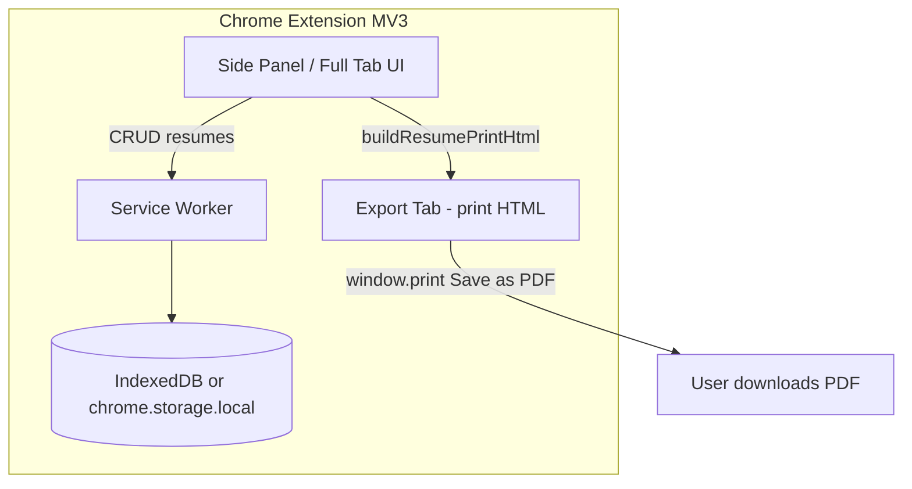

# Chrome Extension Plan — Resume Builder (Local Storage + PDF)

## Goal

Ship a **Manifest V3 Chrome extension** that reuses the existing React editor and preview, stores resumes **locally in the browser**, supports **create / load / delete**, and exports **WYSIWYG PDF** — with **no backend, Docker, or PostgreSQL**.

---

## Scope

### v1 (MVP)

| In | Out (v1) |
|---|---|
| Full editor + live preview | DOCX export |
| Multiple saved resumes | Cloud sync |
| Auto-save to local storage | Server API |
| Delete resume | Account/login |
| PDF export (print-based) | Cross-browser (Firefox/Safari) |
| ATS panel + checks | Import from LinkedIn |

### v2 (optional later)

- Export/import JSON backup
- Optional Google Drive sync
- DOCX via client-side library
- “Silent” PDF download via offscreen document

---

## High-level architecture



**UI surface:** Side panel (best for “always available while job hunting”) or dedicated extension tab. Avoid a small popup — the current layout needs width.

**Storage:** Service worker or UI layer talks to **IndexedDB** (recommended) or `chrome.storage.local`.

**PDF:** Reuse `buildResumePrintHtml()` → open HTML in extension page → user prints to PDF (same rendering engine as today’s Chromium path).

---

## Repo structure (recommended)

### Option A — Monorepo (recommended)

Keep one repo; share UI code between web app and extension.

```text
resume-builder/
├── frontend/              # existing web app (unchanged long-term)
├── extension/
│   ├── manifest.json
│   ├── src/
│   │   ├── background/    # service worker
│   │   ├── pages/         # sidepanel.html, export.html
│   │   ├── storage/       # IndexedDB adapter
│   │   ├── export/        # print PDF flow
│   │   └── main.tsx       # extension entry (wraps shared App)
│   ├── vite.config.ts     # @crxjs/vite-plugin or custom MV3 build
│   └── package.json
└── shared/                # extracted from frontend/src
    ├── components/
    ├── hooks/
    ├── templates/
    ├── types/
    └── utils/
```

### Option B — Fork extension only

Copy `frontend/` into `extension/` and diverge. Faster to start, harder to maintain.

**Recommendation:** Option A — extract shared code once, then both products stay in sync.

---

## What to reuse vs replace

| Current file | Extension action |
|---|---|
| `frontend/src/components/*` | Reuse as-is |
| `frontend/src/templates/*` | Reuse |
| `frontend/src/utils/ats.ts`, `defaults.ts`, `exportPrintHtml.ts` | Reuse |
| `frontend/src/hooks/useResumeEditor.ts` | Swap API calls for storage adapter |
| `frontend/src/api/client.ts` | Replace with `storage/resumeStore.ts` |
| `frontend/src/App.tsx` | Thin wrapper; drop DOCX button in v1 |
| `frontend/src/utils/locationApi.ts` | Reuse (`country-state-city` is bundled, no network) |
| Backend, Docker, Postgres | Not used |

---

## Storage design

### Data model (same shape as today)

```ts
interface StoredResume {
  id: string;           // uuid
  title: string;
  data: ResumeData;     // existing type from types/resume.ts
  createdAt: string;    // ISO
  updatedAt: string;    // ISO
}
```

### Storage backend

**Primary: IndexedDB** via `idb` (small wrapper library)

- No practical size worry for dozens of resumes
- Good for large JSON + future attachments
- Async, fits debounced auto-save

**Fallback:** `chrome.storage.local` with `unlimitedStorage` permission if you want simpler API (watch ~5 MB default limit).

### API surface (mirrors current `api/client.ts`)

```ts
listResumes(): Promise<StoredResume[]>
getResume(id): Promise<StoredResume>
createResume(title, data): Promise<StoredResume>
updateResume(id, title, data): Promise<StoredResume>
deleteResume(id): Promise<void>
```

### Auto-save

Keep existing debounce in `useResumeEditor` (2s). Replace `api.updateResume` / `api.createResume` with storage calls. No network latency — saves will feel instant.

---

## PDF export design

### v1 flow (simple, high quality)

1. User clicks **Export PDF**
2. Call existing `buildResumePrintHtml(editor.data)` from `exportPrintHtml.ts`
3. Open `chrome-extension://…/export.html` (or blob URL in extension tab)
4. Inject HTML, wait for fonts (`document.fonts.ready`)
5. Call `window.print()` with `@page` CSS already in print overrides
6. User chooses **Save as PDF** in Chrome’s print dialog

**Why this works:** Same CSS, fonts, pills, icons, and page-break rules as the web app. No server Chromium needed.

### v1 UX polish

- Export tab opens with instructions: “Choose **Save as PDF** as destination”
- Auto-close tab after print dialog closes (optional)
- Filename hint via `<title>` tag

### v2 (optional silent download)

- `chrome.offscreen` document + `chrome.debugger` PrintToPDF — more complex, needs `debugger` permission (bad for Chrome Web Store review)
- Or explore `html2pdf.js` — easier but lower fidelity

**Recommendation:** Ship v1 print dialog first; it matches the current WYSIWYG goal with minimal risk.

---

## Extension manifest (sketch)

```json
{
  "manifest_version": 3,
  "name": "Resume Builder",
  "version": "1.0.0",
  "description": "Build and export resumes locally — no account required.",
  "permissions": ["storage", "sidePanel"],
  "optional_permissions": ["unlimitedStorage"],
  "side_panel": {
    "default_path": "sidepanel.html"
  },
  "action": {
    "default_title": "Open Resume Builder"
  },
  "background": {
    "service_worker": "background.js",
    "type": "module"
  },
  "icons": { "16": "icons/16.png", "48": "icons/48.png", "128": "icons/128.png" },
  "content_security_policy": {
    "extension_pages": "script-src 'self'; object-src 'self'; style-src 'self' 'unsafe-inline' https://fonts.googleapis.com; font-src https://fonts.gstatic.com;"
  }
}
```

**Permissions kept minimal:** `storage` only. No `host_permissions` unless you add external APIs later.

**Google Fonts:** Allow `fonts.googleapis.com` and `fonts.gstatic.com` in CSP (CustomizationPanel already uses Google Fonts).

---

## Implementation phases

### Phase 0 — Spike (1–2 days)

**Goal:** Prove extension shell + one save + one PDF.

- [ ] Create `extension/` with Vite + `@crxjs/vite-plugin`
- [ ] Load side panel with “Hello world” React
- [ ] Save/load one resume in IndexedDB
- [ ] Open export page and print HTML from `buildResumePrintHtml`

**Exit criteria:** Manual test — edit name → refresh extension → data persists → PDF looks like preview.

---

### Phase 1 — Extract shared package (2–3 days)

**Goal:** Stop duplicating UI code.

- [ ] Move `components/`, `templates/`, `types/`, `utils/` (except API-specific) into `shared/`
- [ ] Update `frontend/` imports to `@shared/...`
- [ ] Extension imports same shared modules
- [ ] Verify web app still builds and runs

**Exit criteria:** Both `frontend` and `extension` build from shared code.

---

### Phase 2 — Storage layer + editor wiring (2–3 days)

**Goal:** Full CRUD locally.

- [ ] Implement `storage/resumeStore.ts` (IndexedDB)
- [ ] Refactor `useResumeEditor` to accept a `ResumeRepository` interface (web vs extension inject different impl)
- [ ] Wire `SavedResumesPanel` delete/load to local storage
- [ ] Remove server-only code paths from extension build (tree-shake `api/client.ts`)

**Exit criteria:** Create 3 resumes, switch between them, delete one, all without any server.

---

### Phase 3 — PDF export + polish (1–2 days)

**Goal:** Production-quality export UX.

- [ ] `export/openPrintView(html, filename)` helper
- [ ] Font loading wait before print
- [ ] Loading state on Export button
- [ ] Error toast if print blocked
- [ ] Hide DOCX in extension UI (or show “coming soon”)

**Exit criteria:** PDF matches side-panel preview for all 4 templates.

---

### Phase 4 — Extension UX & packaging (2–3 days)

**Goal:** Store-ready extension.

- [ ] Toolbar icon + side panel open on click
- [ ] “New resume” / “Duplicate resume” actions
- [ ] Empty state onboarding copy (“Data stays on this device”)
- [ ] Icons 16/48/128, screenshots, privacy policy page
- [ ] Build zip for Chrome Web Store
- [ ] Test load unpacked in Chrome + Edge (Chromium)

**Exit criteria:** Unpacked extension usable end-to-end; store listing assets ready.

---

### Phase 5 — QA checklist

- [ ] Auto-save after edit (2s debounce)
- [ ] Skills comma input works in extension
- [ ] All section types render in preview + PDF
- [ ] Google Fonts load in extension CSP
- [ ] Location picker works offline (`country-state-city`)
- [ ] Delete active resume → editor resets
- [ ] Storage survives browser restart
- [ ] Large resume (long experience) — PDF page breaks OK
- [ ] No console errors in service worker

---

## Key refactors (minimal diff strategy)

### 1. Repository abstraction

```ts
// shared/storage/types.ts
export interface ResumeRepository {
  list(): Promise<Resume[]>;
  get(id: string): Promise<Resume>;
  create(title: string, data: ResumeData): Promise<Resume>;
  update(id: string, title: string, data: ResumeData): Promise<Resume>;
  delete(id: string): Promise<void>;
}
```

- Web app: `HttpResumeRepository` → existing `api/client.ts`
- Extension: `IndexedDbResumeRepository` → local storage

### 2. Hook injection

```ts
useResumeEditor({ repository, onSaved })
```

### 3. Build-time flag (optional)

```ts
const IS_EXTENSION = import.meta.env.VITE_TARGET === 'extension';
```

Use to hide DOCX, change header copy, etc.

---

## Risks & mitigations

| Risk | Mitigation |
|---|---|
| Side panel too narrow | Use full tab fallback (`chrome.tabs.create`) for editor |
| Print dialog feels clunky | Clear UX copy; v2 offscreen if needed |
| CSP blocks fonts/styles | Test early; allow Google Fonts in manifest |
| Bundle size (country-state-city) | Already in web app; acceptable for extension |
| Shared code drift | Monorepo + single `shared/` package |
| User loses data on uninstall | v2: export/import JSON backup |

---

## Effort estimate

| Phase | Time |
|---|---|
| Phase 0 — Spike | 1–2 days |
| Phase 1 — Shared extract | 2–3 days |
| Phase 2 — Storage + CRUD | 2–3 days |
| Phase 3 — PDF export | 1–2 days |
| Phase 4 — Polish + store prep | 2–3 days |
| **Total v1** | **~8–13 days** (solo, part-time adjust accordingly) |

---

## Success criteria for v1 launch

1. User installs extension — no signup, no server
2. User builds a resume with live preview
3. Resume auto-saves locally
4. User can list, load, and delete saved resumes
5. PDF export visually matches preview
6. Privacy story: “Your data never leaves your browser”

---

## Suggested first PR sequence

1. `extension: scaffold MV3 + side panel + Vite`
2. `shared: extract components, types, utils from frontend`
3. `storage: IndexedDB resume repository + tests`
4. `extension: wire useResumeEditor to local repository`
5. `extension: client-side PDF export via print HTML`
6. `extension: store assets, README, privacy policy`

---

## Relationship to current web app

The web app and extension can **coexist**:

- **Web app** — hosted version with server PDF (Chromium), Postgres, optional multi-device
- **Extension** — offline-first, privacy-focused, no hosting cost

Same editor, two deployment targets.
